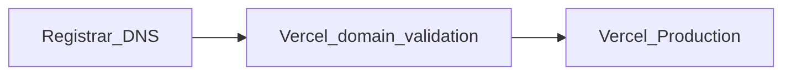

# aiBuddy — Custom domain (wfwonder.com)

**Status:** Execute per [GitHub issue #1](https://github.com/aibudoptimization/aiBuddy/issues/1)  
**Repo:** [https://github.com/aibudoptimization/aiBuddy.git](https://github.com/aibudoptimization/aiBuddy.git)  
**Domain:** `wfwonder.com`  
**Related:** [REPO_AND_VERCEL_SETUP_PLAN.md](./REPO_AND_VERCEL_SETUP_PLAN.md) (custom domain section) · [GITHUB_ISSUES_GUIDE.md](../GITHUB_ISSUES_GUIDE.md)

This plan covers attaching **wfwonder.com** to the **Vercel** production deployment, **DNS** at the registrar, **HTTPS**, and **`NEXT_PUBLIC_SITE_URL`** so Next.js `metadataBase` and Open Graph URLs are correct ([`web/src/app/layout.tsx`](../web/src/app/layout.tsx), [`web/.env.example`](../web/.env.example)).

---

## 1. Purpose and definition of done

### Purpose

- Visitors reach the live site at **https://wfwonder.com** (or a documented canonical URL) instead of only the default `*.vercel.app` hostname.
- TLS is provisioned by Vercel; no mixed-content or certificate warnings for the primary hostname.

### Definition of done

- Domain(s) appear in Vercel **Project → Settings → Domains** with **valid** configuration after DNS propagation.
- **HTTPS** works for the canonical hostname; optional **`www`** hostname redirects to canonical (or the reverse), consistently.
- Vercel **Production** environment defines **`NEXT_PUBLIC_SITE_URL`** exactly as the canonical origin (e.g. `https://wfwonder.com`, no trailing slash per `.env.example`).
- A production deployment has run **after** env changes so the build picks up the new value.
- [Issue #1](https://github.com/aibudoptimization/aiBuddy/issues/1) acceptance checklist is satisfied and the issue is closed with a final comment per the issues guide.

---

## 2. Prerequisites

- Vercel project exists, linked to **`aibudoptimization/aiBuddy`**, with **Root Directory** `web` and successful Production deploys from **`main`** (see [REPO_AND_VERCEL_SETUP_PLAN.md](./REPO_AND_VERCEL_SETUP_PLAN.md)).
- Access to **DNS** for `wfwonder.com`. If the domain was purchased via Google Domains, DNS may now be managed in **Squarespace** or another host; use whichever panel actually serves **DNS records** for the zone.
- GitHub issue [**#1** — Point wfwonder.com at Vercel production](https://github.com/aibudoptimization/aiBuddy/issues/1) is open and used for progress comments.

---

## 3. Vercel (dashboard)

1. Open **Vercel** → your **aiBuddy** (or project name) → **Settings** → **Domains**.
2. **Add** `wfwonder.com`.
3. **Add** `www.wfwonder.com` if you want both hostnames (recommended); set redirect to canonical in Vercel after both validate.
4. Vercel will show the **exact DNS records** (e.g. **A** / **AAAA** for apex, **CNAME** for `www`). **Copy these from the UI**; do not rely on third-party screenshots—Vercel may change values per project.

---

## 4. Registrar / DNS

1. In your DNS host, create **only** the records Vercel lists for this project.
2. Remove or avoid **conflicting** records (old A/CNAME on apex or `www` pointing elsewhere).
3. Save changes; note **TTL** (lower TTL speeds up iteration while testing; raise later if desired).
4. Wait for propagation (minutes to hours). Use Vercel’s domain status and optional `nslookup` / [Google Admin Toolbox Dig](https://toolbox.googleapps.com/apps/dig/) if needed.

**Google / Squarespace:** If the domain is registered or DNS-hosted through Squarespace, use their **DNS settings** UI to add the Vercel records; interface labels differ but record types (A, AAAA, CNAME) are standard.

---

## 5. Canonical URL policy

**Default recommendation for this project:** **`https://wfwonder.com`** (apex) is **canonical**; **`https://www.wfwonder.com`** **301 redirects** to the apex via Vercel domain settings.

If you prefer `www` as canonical, invert: set `NEXT_PUBLIC_SITE_URL` to `https://www.wfwonder.com` and redirect apex to `www`. Document the chosen policy in a short issue comment when done.

---

## 6. Application configuration (environment variables)

- In Vercel → **Project** → **Settings** → **Environment Variables**:
  - Set **`NEXT_PUBLIC_SITE_URL`** = `https://wfwonder.com` (or your canonical URL), scope **Production**.
- **Redeploy** Production (e.g. **Deployments** → ⋮ on latest → **Redeploy**, or push an empty commit) so the new variable is baked into the build.

**Preview deployments:** Previews can keep the default Vercel preview URL for `metadataBase` or you can omit `NEXT_PUBLIC_SITE_URL` in Preview if acceptable; avoid pointing Preview at production domain unless intentional.

---

## 7. Verification checklist

- [ ] Browser: `https://wfwonder.com` loads the site; certificate is valid.
- [ ] Non-canonical host (e.g. `www`) redirects as configured.
- [ ] Vercel domain rows show **Valid** configuration.
- [ ] Response headers / page: no unexpected redirect loops.
- [ ] Optional: share-debug tools (e.g. Meta Sharing Debugger) to confirm **og:url** / preview origin matches production, not `localhost`.

---

## 8. Rollback

- In Vercel **Domains**, remove `wfwonder.com` / `www` if you must revert quickly.
- At DNS: restore previous records only if you still need the old destination; otherwise removing wrong records is enough once Vercel domain is removed.

---

## 9. Cross-references

| Resource | Link |
|---------|------|
| Tracking issue | [#1](https://github.com/aibudoptimization/aiBuddy/issues/1) |
| Issues workflow | [`GITHUB_ISSUES_GUIDE.md`](../GITHUB_ISSUES_GUIDE.md) |
| Repo + Vercel baseline | [`REPO_AND_VERCEL_SETUP_PLAN.md`](./REPO_AND_VERCEL_SETUP_PLAN.md) |

When implementation work is done in git (docs-only PR), use branch naming such as **`chore/1-custom-domain-wfwonder`** and **`Closes #1`** only when **all** acceptance criteria—including live DNS and env—are met.
